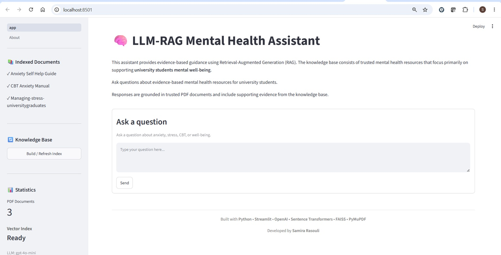
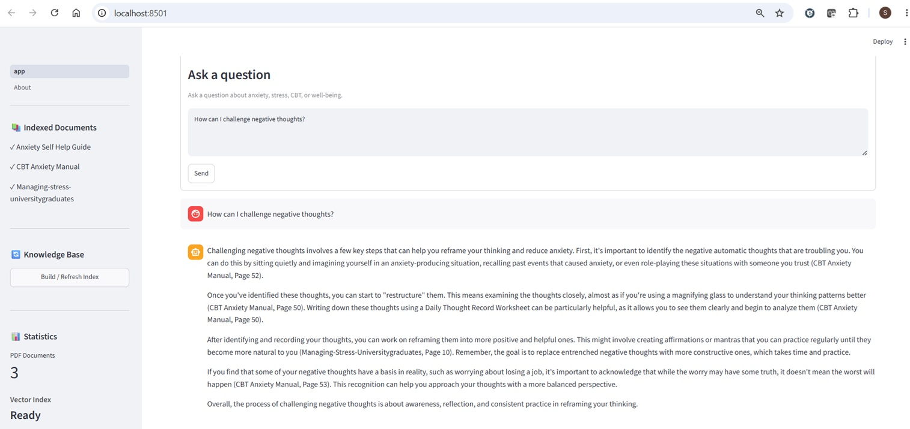
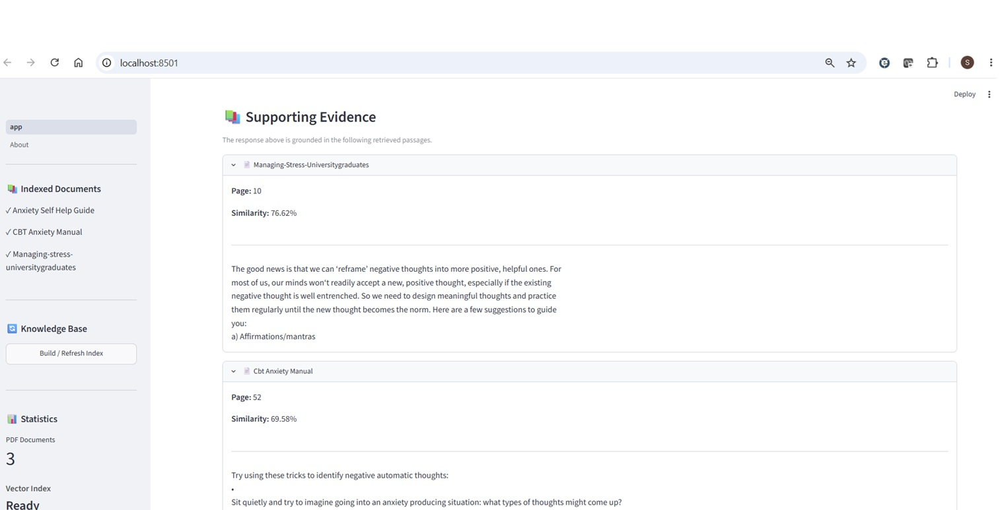

# LLM-RAG Mental Health Assistant

A Retrieval-Augmented Generation (RAG) application for question answering over a collection of evidence-based mental health resources.

The application processes PDF documents into a searchable vector database, retrieves the most relevant document passages for a user query, and uses an OpenAI language model to generate responses grounded in the retrieved content. Supporting source passages are displayed alongside each response to improve transparency.

Although this implementation uses mental health resources, the pipeline can be applied to any document collection by replacing the source PDFs and adjusting the prompt in (prompts.py)

---

## Data Source

The knowledge base consists of evidence-based PDF guides designed to help university students manage stress and anxiety through self-guided strategies. These documents serve as the retrieval source for the RAG pipeline.

The RAG pipeline is domain-independent and can be adapted to any collection of PDF documents by replacing the source files.

---
## Example Interface

### Question Answering



The application retrieves the most relevant passages from the indexed knowledge base using semantic search and generates an evidence-based response through Retrieval-Augmented Generation (RAG).

### Generated Response



The assistant answers the user's question using the retrieved document context.

### Supporting Evidence



Each response is accompanied by the supporting document names, page numbers, similarity scores, and the retrieved passages used as context for the language model, allowing users to verify how the answer was generated.

## Features

- Retrieval-Augmented Generation (RAG)
- Semantic search over PDF documents
- Dense vector embeddings using Sentence Transformers
- FAISS vector database for similarity seaarch
- Grounded responses generated with OpenAI GPT models
- Supporting source passages displayed with each response
- Interactive Streamlit web interface with chat input
- Persistent conversation history with sources re-displayed on scroll
- Vector index creation and refresh from the application
- Comprehensive error handling (API failures, missing PDFs, corrupted files)

---

## System Architecture

```text
PDF Documents
      │
      ▼
Text Extraction (PyMuPDF)
      │
      ▼
Document Chunking
      │
      ▼
Sentence Transformer Embeddings
      │
      ▼
FAISS Vector Store
      │
      ▼
Similarity Search
      │
      ▼
Relevant Document Chunks
      │
      ▼
OpenAI GPT-4o Mini
      │
      ▼
Grounded Response + Source Passages
```

---

## Technology Stack

| Component | Technology |
|-----------|------------|
| Language | Python |
| Interface | Streamlit |
| LLM | OpenAI GPT-4o Mini |
| Embeddings | all-MiniLM-L6-v2 |
| Vector Database | FAISS |
| PDF Processing | PyMuPDF |
| Text Splitting | LangChain Text Splitters |
| Environment | python-dotenv |

---

## Project Structure

```text
LLM-RAG-Mental-Health-Assistant/
│
├── app.py                  # Streamlit application
├── config.py               # All configuration constants
├── requirements.txt
├── .env.example            # Template for environment variables
│
├── data/
│   └── pdfs/               # Place your PDF documents here
│
├── pages/
│   └── About.py            # Streamlit multi-page About section
│
└── utils/
    ├── pdf_loader.py       # PDF text extraction
    ├── chunker.py          # Document chunking
    ├── embeddings.py       # Sentence Transformer embeddings
    ├── vector_store.py     # FAISS index build / save / load / search
    ├── llm.py              # OpenAI API calls
    ├── rag_pipeline.py     # Orchestrates the full pipeline
    ├── prompts.py          # System prompt and prompt builder
    └── helpers.py          # Shared utility functions
```

The `database/` folder is created automatically when the index is built and is excluded from version control.

---

## Installation

Clone the repository.

```bash
git clone https://github.com/yourusername/LLM-RAG-Mental-Health-Assistant.git
cd LLM-RAG-Mental-Health-Assistant
```

Create and activate a virtual environment.

**Windows**
```bash
python -m venv .venv
.venv\Scripts\activate
```

**macOS / Linux**
```bash
python3 -m venv .venv
source .venv/bin/activate
```

Install the required packages.

```bash
pip install -r requirements.txt
```

---

## Configuration

Copy the environment template and add your API key.

```bash
cp .env.example .env
```

Edit `.env`:

```text
OPENAI_API_KEY=your_openai_api_key
MODEL_NAME=gpt-4o-mini          # optional — this is the default
```

All other tuneable values (chunk size, overlap, retrieval depth, temperature) are in `config.py`.

---

## Preparing the Knowledge Base

Place PDF documents in:

```text
data/pdfs/
```


## Running the Application

```bash
streamlit run app.py
```

After launching the application, click **Build / Refresh Index** in the sidebar to generate the vector database, then ask questions.

---

## Pipeline Scripts

These scripts run the pipeline stages from the command line without the UI, useful for debugging or batch indexing.

```bash
python test_build.py       # Build the FAISS index from PDFs
python test_chunker.py     # Inspect chunking output
python test_embeddings.py  # Check embedding shapes
python test_rag.py         # Run a full end-to-end query
```

---

## Example Questions

- How can I reduce anxiety before public speaking?
- What is cognitive restructuring?
- How can I manage exam anxiety?
- What strategies can help reduce stress?
- How can I challenge negative thoughts?

---

## How It Works

1. PDF documents are loaded and parsed with PyMuPDF.
2. Documents are divided into overlapping text chunks.
3. Each chunk is converted into a dense vector embedding (L2-normalized).
4. Embeddings are indexed in FAISS using inner-product search (equivalent to cosine similarity after normalization).
5. User queries are embedded into the same vector space.
6. The most relevant document chunks are retrieved (Top-K).
7. Retrieved context is injected into a prompt and sent to the language model.
8. The application returns a grounded response together with the supporting document passages.

---

 

## Author

**Samira Rasouli**

Artificial Intelligence & Machine Learning
University of Waterloo
